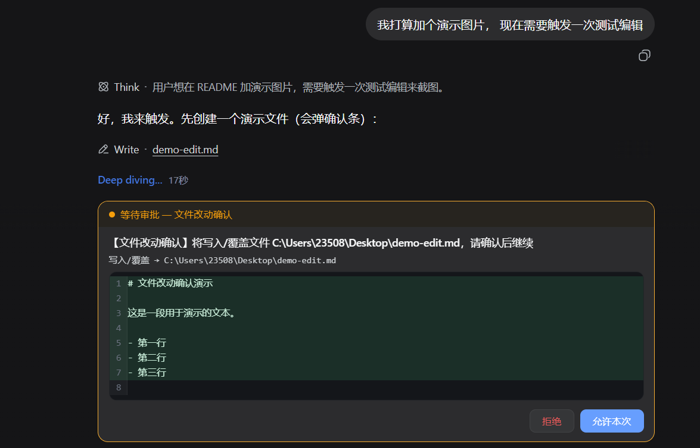

# dsh-file-confirm — 文件改动确认机制

[](https://awesome-dsh-plugin.com)
[](https://www.npmjs.com/package/dsh-file-confirm)
[](LICENSE)

双面插件：**任何文件改动（write / edit / str_replace_editor 的写命令）执行前，都会在
输入区出现确认条，确认条内直接展示 diff 红绿文本**（新建全绿、编辑红删绿增）；
用户点「允许本次」才放行，点「拒绝」则该次工具调用以失败结束（模型能看到拒绝原因并调整）。

## 演示效果



## 使用流程

```
模型调用 write / edit / str_replace_editor
  → 确认条弹出（标题 + 文件路径 + 内嵌 diff 红绿预览）
  → 你点「允许本次」→ 工具执行，文件写入
  → 你点「拒绝」   → 工具失败，模型收到拒绝原因并调整
```

- 只拦文件写操作；`read`、搜索、bash 等不受影响
- 其他工具的审批（如 bash 沙箱升级）仍走内置面板
- 长文本 diff 不截断，块内滚动查看

## 文档

- [Changelog](CHANGELOG.md)
- [测试说明](TESTING.md)

## 与生态对比

| 插件 | 定位 | 差异 |
|---|---|---|
| `dsh-tool-approval` | 任意工具调用预审批（include/exclude 通配符） | 通用黑盒确认（只显示工具名+原因），**无内容预览** |
| `dsh-permgate` | 细粒度权限网关（规则/白黑名单/分类） | 重型权限管理，需要配置规则 |
| `dsh-change-review` | 会话内 write/edit **事后** diff 审查 | 写后审查，非写前确认 |
| **本插件** | **写前确认 + 内嵌 diff 内容预览** | 零配置、专注文件写入、允许/拒绝前看到确切改动 |

## 原理

利用 DSH 的官方扩展点，**零侵入、不修改任何内置包**：

```
工具调用
  │
  ▼
tools/pre-execute（可重排 allow/deny/ask 门）   ← Host 半身在此拦截
  │ 返回 { kind:'ask', reason }
  ▼
ctx.approval.request() → web 网关 → 浏览器
  │
  ▼
conversation.composer（chain slot, priority 0） ← Browser 半身在此接管渲染
  │  内置 ApprovalPanel 是 priority 1（先注册先被尝试，我的条目先被选中）
  ▼
确认条（标题 + 文件路径 + 内嵌 diff 红绿文本 + 拒绝 / 允许本次）
```

- Host 半身（`lib/index.js`）：监听 `tools/pre-execute`，对文件改动工具返回
  `{ kind: 'ask', reason }`；其余工具调用 `next()` 委托，与其他门共存。
- Browser 半身（`lib/client.js`）：在 `conversation.composer` chain slot 注册
  priority 0 条目，selector 只匹配文件改动类审批；其他审批（如 bash 沙箱升级）
  返回 null，仍由内置 ApprovalPanel 处理。
- diff 渲染：从会话快照的配对工具调用参数（`argsRaw`）取内容，
  用简易行级 diff（公共前后缀 + 中间替换）渲染红删绿增：
  - `write` → 新内容全文（绿）
  - `edit` → old_string / new_string 行级对照（红删绿增）
  - `str_replace_editor` → str_replace / insert / write 命令分别渲染
- 确认响应复用内置 wire 编码：`wait.respond({ ok, value: { sessionId,
  approvalId, outcome } })`，审计记录（approval/asked、approval/decided）照常写入。

## 安装（bundle）

```sh
dsh plugin --profile web add dsh-file-confirm
```

或手动在 `$DSH_HOME/profiles/web/cordis.patch.yml` 里挂载：

```yaml
- insert:
    - id: file-confirm
      name: dsh-file-confirm
      config:
        tools: [write, edit, str_replace_editor]   # 可自定义
        # pathPattern: '^src/'                     # 可选：仅对匹配路径确认
        # enabled: true
```

然后重启 `dsh web` 并刷新浏览器页面。

## 配置（cordis.patch.yml 中该行的 config）

| 键 | 默认 | 说明 |
|---|---|---|
| `tools` | `[write, edit, str_replace_editor]` | 拦截的工具名列表 |
| `pathPattern` | 无 | RegExp 字符串；仅对匹配的文件路径确认 |
| `enabled` | `true` | 总开关 |

## 卸载

```sh
dsh plugin --profile web remove dsh-file-confirm
```

## 文件

```
cordis.patch.yml   bundle patch：dsh plugin add 时自动注册插件行
package.json       双面插件声明（dsh.bundle + dsh.client）
lib/index.js       Host 半身：tools/pre-execute 拦截
lib/client.js      Browser 半身：conversation.composer chain + 内嵌 diff 确认条
showtime.png       演示截图
```

## 许可证

[MIT](LICENSE) © 2026 dsh-file-confirm contributors
